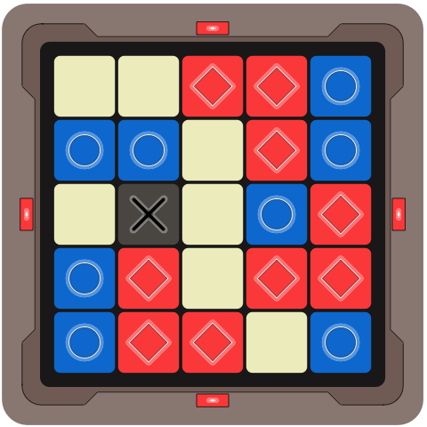

# MiniProject_CodeNamesCard

The MiniProjects are small tasks for the purpose of getting practice in multiple languages.

CodeNamesCard should be a small application that can make a card modeled after the clue-givers map in the game Code Names.  The map uses colored squares in a 5x5 grid to indicate which positions (which spies) are one the red team, blue team, tan (innocent by-stander) or black (the assassin).  

The user should be able to control:         

 * the size of the grid (default 5x5, and defaults to square if only width or height is set),
 * The number of assassins (default 1),
 * the number of by-standers (default: floor of 25% of squares),
 * The number of team-spaces for each team (default: (number of squares - assassins - by-standers)/2 max difference of 1 for red and blue).

Given these parameters, the application should produce an image similar to the maps found in the Code Names game.

The output should look as close as possible to the cards in the official game:

](CodeNamesCardRefImage.jpeg)

Go to [boardgamegeek.com](https://boardgamegeek.com/thread/1464156/codenames-review-ocean3-no-wait-dont-say-shark-don) for more description of the original board game.

There is also an official app version on the [app store](https://play.google.com/store/apps/details?id=com.czechgames.codenames).

## Implementations:

### R

The current version represents the nearly optimal functionality.  It will produce a 5x5 grid, as a png file.  The color indicates assassins, by-standers, and red/blue team squares.  The border indicates which team should go first.  Arguments can set the shape of the grid and the number of squares that should be assassins, by-standers, red team squares and blue team squares; with reasonable defaults for all parameters.

Use `Rscript R/CodeNamesCard.R --help` to see the available arguments for the R version of the program.

Unfortunately, switching to the grid package as drawing the engine introduced a bug.  The plot region is not dynamically sized to accommodate however many squares the user has asked for.  It currently makes a very nice image for a 5x5, but for larger grids the image is cropped.

Example output of CodeNames.R (set seed 76):

### Shiny

The Shiny implementation builds on the R implementation.  It calls the functions written for the R version, but rather than running it from the command line and saving a file, the user run an web-page-like interface to supply the inputs and view the result.

Unlike the base R implementation, the user cannot explicitly set the number of innocent by-standers.  This variable is absent from the interface so it can be adjusted as need to accommodate the variables that are specified without the user having to add up the number spaces they are creating and using.

### Python

The python implementation is in python 2.7.  The current version represents baseline functionality.

Use `python CodeNamesCard.py --help` to see the available arguments for the R version of the program.

Example output of CodeNames.py (set seed 76):

